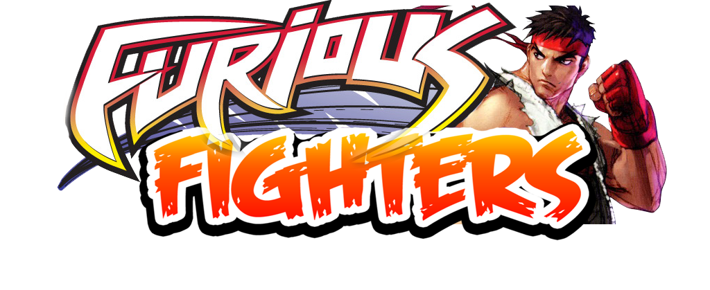

# Furios Fighters
A fighting game coded in C++. It is not completed project, so if anyone is interested, can complete this project and ask me for help if required.

External Libraries (dependencies):
1. SDL.h 	(SDL Library)
2. SDL_image.h 	(SDL extension)
3. SDL_mixer.h  (SDL extension)

Here are some glimpse of game:

  

